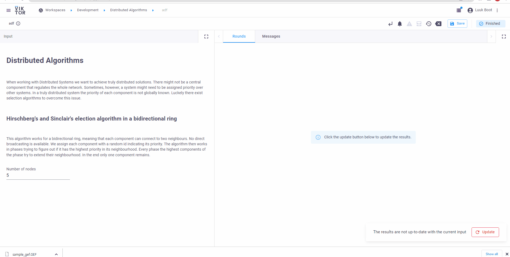

 <Please check version is the same as specified in requirements.txt>
# Distributed Algorithms

When working with Distributed Systems we want to achieve truly distributed solutions. There might not be a central component that regulates the whole network. Sometimes, however, a system might need to be assigned priority over other systems. In a truly distributed system, the priority of each component is not globally known. Luckily there exist selection algorithms to overcome this issue.

## Hirschberg's and Sinclair's election algorithm in a bidirectional ring

This algorithm works for a bidirectional ring, meaning that each component can connect to two neighbours. No direct broadcasting is available. We assign each component with a random id indicating its priority. The algorithm then works in phases trying to figure out if it has the highest priority in its neighbourhood. Every phase the highest components of the phase try to extend their neighbourhood. In the end, only one component remains.

## Simulation

For the simulation of the algorithm, we build a local network with Pyro4, see an animitation of the VIKTOR app above. This package allows us to build objects that can talk to each other, not limited by only a local network. This makes the simulation close to how it would be implemented on a WAN. Ofcourse because our implementation runs locally we cheat a bit in the optimization by shutting down the algorithm after the node that we know is going to win. In reality, if a node is selected, it will notify the other nodes. Our method does not alter the algorithm itself.
